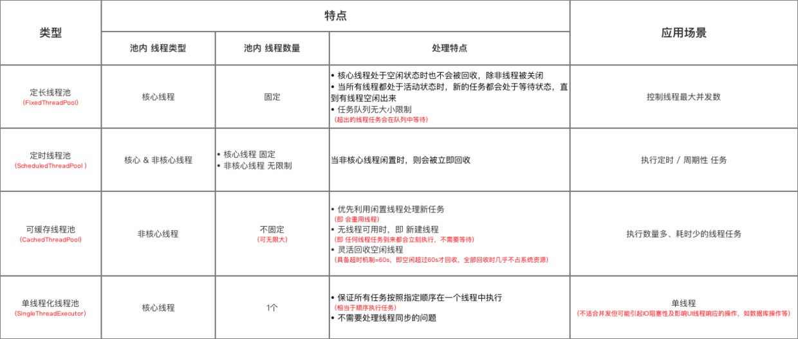

## corePoolSize和maximumPoolSize
ThreadPoolExecutor将根据corePoolSize和maximumPoolSize设置的边界自动调整池的大小，当有新的请求提交时:  
1）如果线程少于corePoolSize，则创建新的线程来处理请求，即使其他的辅助线程是空闲的;  
2）如果线程数量等于corePoolSize，当有新的请求过来时，若workQueue任务阻塞队列未满，则将请求放入workQueue中，等待有空闲的线程从workQueue中取出任务;  
3）如果线程数量大于等于corePoolSize且少于maximumPoolSize，则仅当workQueue任务阻塞队列满时才创建新线程处理;  
4）如果线程的数量大于corePoolSize并且等于maximumPoolSize，若此时workQueue已满，则通过handler所指定的策略来处理请求。  

当池中的线程数量大于corePoolSize的时候，多余的线程会等待keepAliveTime长的时间，如果无请求处理，就会自动销毁。

## 拒绝策略  
ThreadPoolExecutor.AbortPolicy:丢弃任务并抛出RejectedExecutionException异常。 
ThreadPoolExecutor.DiscardPolicy：也是丢弃任务，但是不抛出异常。 
ThreadPoolExecutor.DiscardOldestPolicy：丢弃队列最前面的任务，然后重新尝试执行任务（重复此过程）  
ThreadPoolExecutor.CallerRunsPolicy：由调用线程处理该任务 

## 缓存策略  
在前面我们多次提到了任务缓存队列，即workQueue，它用来存放等待执行的任务。
workQueue的类型为BlockingQueue<Runnable>，通常可以取下面三种类型：

1）ArrayBlockingQueue：基于数组的先进先出队列，此队列创建时必须指定大小；

2）LinkedBlockingQueue：基于链表的先进先出队列，如果创建时没有指定此队列大小，则默认为Integer.MAX_VALUE；

3）synchronousQueue：这个队列比较特殊，它不会保存提交的任务，而是将直接新建一个线程来执行新来的任务。

## 四种线程池  
- newCachedThreadPool创建一个可缓存线程池，如果线程池的长度超过处理需要，可以灵活的回收空闲线程，若无法回收，则创建新的线程
- newFixedThreadPool创建一个可重用固定个数的线程池，以共享的无界队列方式来运行这些线程。
- newScheduledThreadPool创建一个定长线程池，支持定时及周期性任务执行
- newSingleThreadPool创建一个单线程化的线程池，它只会用唯一的工作线程来执行任务，保证所有的任务按照执行顺序执行。
  

## 常见线程池 总结&对比

## 为什么要用线程池
使用线程池的好处：
- 降低资源的消耗：通过重复利用已创建的线程降低线程创建和销毁造成的消耗
- 提高响应速度：当任务到达时，任务可以不需要等待线程的创建就能立即执行
- 提高线程的可管理性：使用线程池可以对线程进行集中的管理，调优和监控

