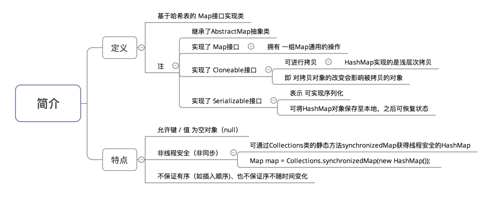
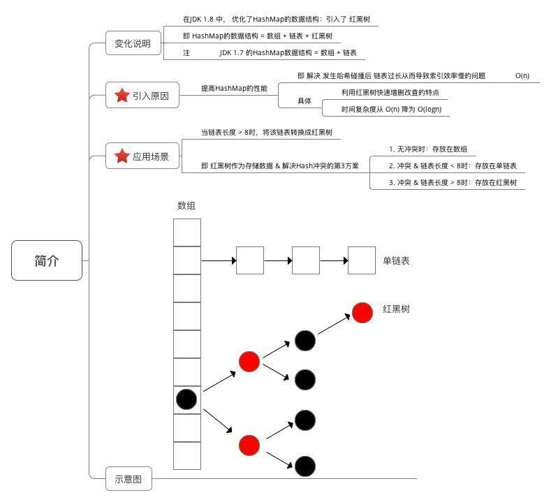
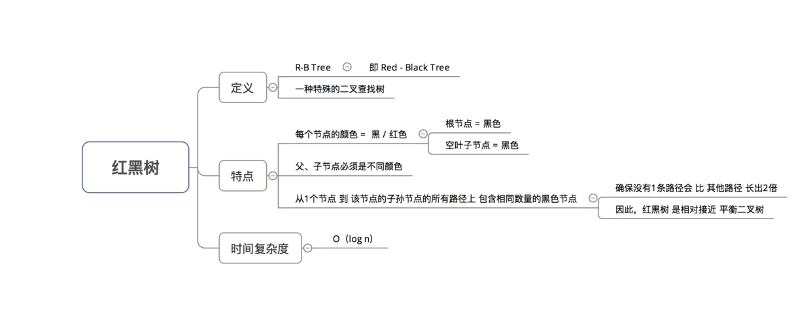
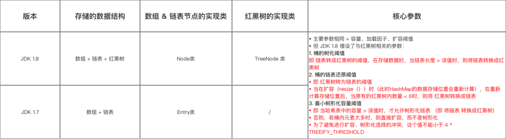
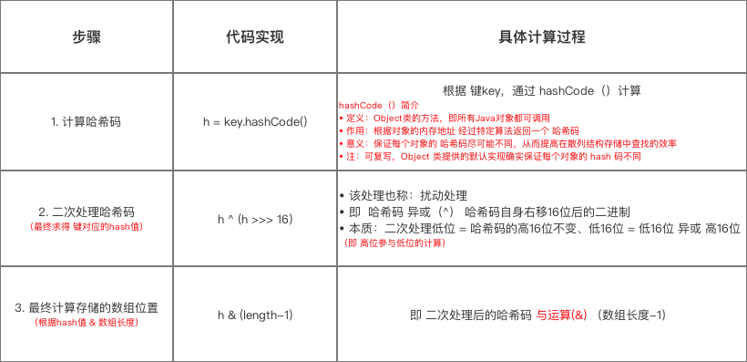

## HashMap简介


## 数据结构：引入红黑树  
### 主要介绍  
1. 变化说明  
   在JDK1.8中优化了HashMap的数据结构，引入了红黑树，即现在的数据结构变为数组+链表+红黑树，而在1.7中只使用了链表和数组。
2. 引入原因  
   提高了HashMap的性能，解决了当哈希冲突后链表长度过长从而导致的查询的效率变慢O(N)，而引入红黑树之后，利用红黑树的特点，可以将查询效率降到O(logN)。
3. 应用场景  
   当链表的长度>8时，将链表转换成红黑树。解决Hash冲突的三种方案：a. 无冲突，直接存放在在数组中，b. 冲突但是链表长度<8,存放在链表中，c. 冲突但是链表长度>8，存放在红黑树中。 



### 红黑树的特点


## 数据结构和参数与1.7之间的区别


## hash(key)
```Java
/**
     * 分析1：hash(key)
     * 作用：计算传入数据的哈希码（哈希值、Hash值）
     * 该函数在JDK 1.7 和 1.8 中的实现不同，但原理一样 = 扰动函数 = 使得根据key生成的哈希码（hash值）分布更加均匀、更具备随机性，避免出现hash值冲突（即指不同key但生成同1个hash值）
     * JDK 1.7 做了9次扰动处理 = 4次位运算 + 5次异或运算
     * JDK 1.8 简化了扰动函数 = 只做了2次扰动 = 1次位运算 + 1次异或运算
     */

      // JDK 1.7实现：将 键key 转换成 哈希码（hash值）操作  = 使用hashCode() + 4次位运算 + 5次异或运算（9次扰动）
      static final int hash(int h) {
        h ^= k.hashCode(); 
        h ^= (h >>> 20) ^ (h >>> 12);
        return h ^ (h >>> 7) ^ (h >>> 4);
     }

      // JDK 1.8实现：将 键key 转换成 哈希码（hash值）操作 = 使用hashCode() + 1次位运算 + 1次异或运算（2次扰动）
      // 1. 取hashCode值： h = key.hashCode() 
      // 2. 高位参与低位的运算：h ^ (h >>> 16)  
      static final int hash(Object key) {
           int h;
            return (key == null) ? 0 : (h = key.hashCode()) ^ (h >>> 16);
            // a. 当key = null时，hash值 = 0，所以HashMap的key 可为null      
            // 注：对比HashTable，HashTable对key直接hashCode（），若key为null时，会抛出异常，所以HashTable的key不可为null
            // b. 当key ≠ null时，则通过先计算出 key的 hashCode()（记为h），然后 对哈希码进行 扰动处理： 按位 异或（^） 哈希码自身右移16位后的二进制
     }

   /**
     * 计算存储位置的函数分析：indexFor(hash, table.length)
     * 注：该函数仅存在于JDK 1.7 ，JDK 1.8中实际上无该函数（直接用1条语句判断写出），但原理相同
     * 为了方便讲解，故提前到此讲解
     */
     static int indexFor(int h, int length) {  
          return h & (length-1); 
          // 将对哈希码扰动处理后的结果 与运算(&) （数组长度-1），最终得到存储在数组table的位置（即数组下标、索引）
    }

```
计算放在数组table中的位置  



### 为什么不直接采用经错hashCode()处理的哈希码作为存储数组table的下标？
结论：容易出现哈希码与数组大小范围不匹配的情况，即计算出来的哈希码不咋数组的范围内，从而导致无法匹配存储的位置。

### 为什么采用哈希码与运算(数组长度-1)计算数组下标？
结论：根绝HashMap的容量大小（数组的长度），按需取哈希码的一定数量的低位作为存储在数组中的下标，从而解决“哈希码与数组大小不匹配”的问题。

### 为什么在计算数组下标之前要进行扰动处理？
加大哈希码低位的随机性，使得分布更加均匀，从而减少hash的冲突


## 博客地址
https://blog.csdn.net/carson_ho/article/details/79373134